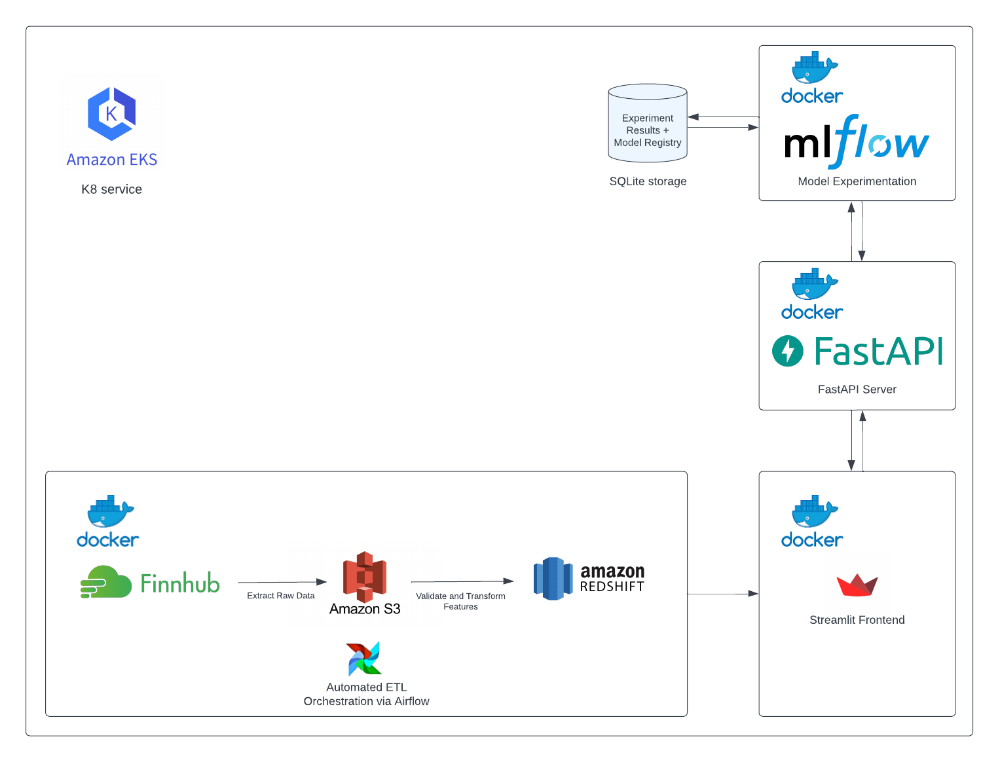
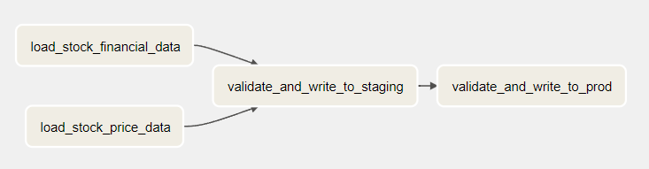
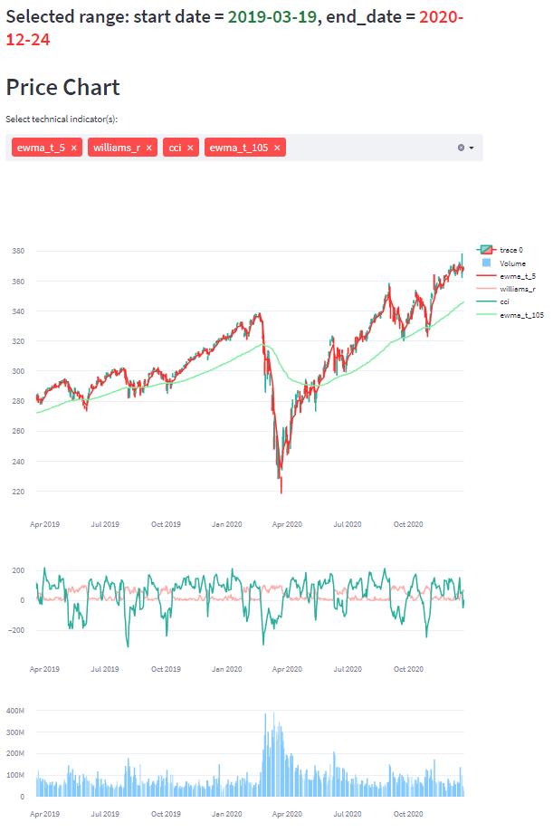
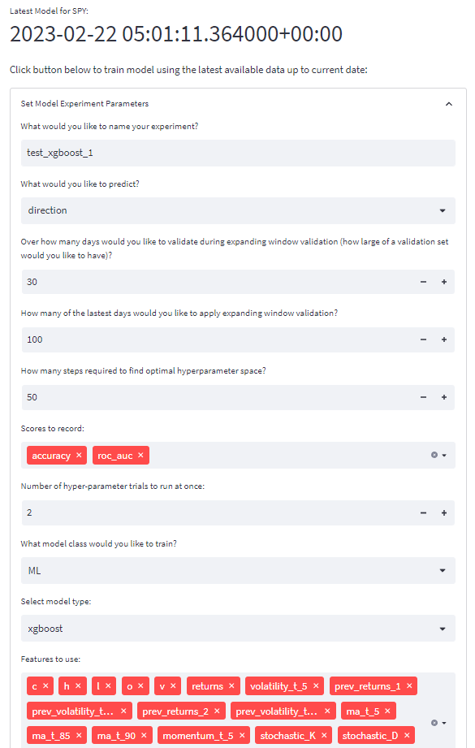
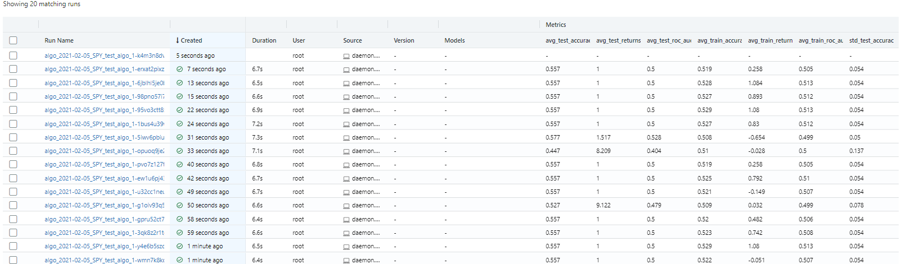
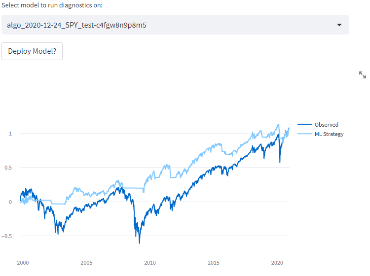
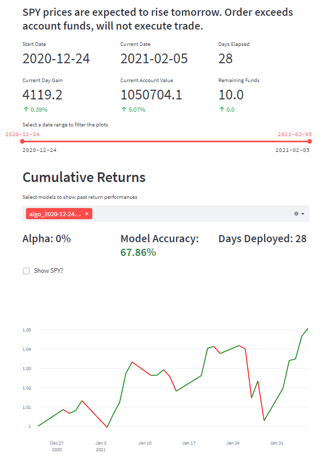
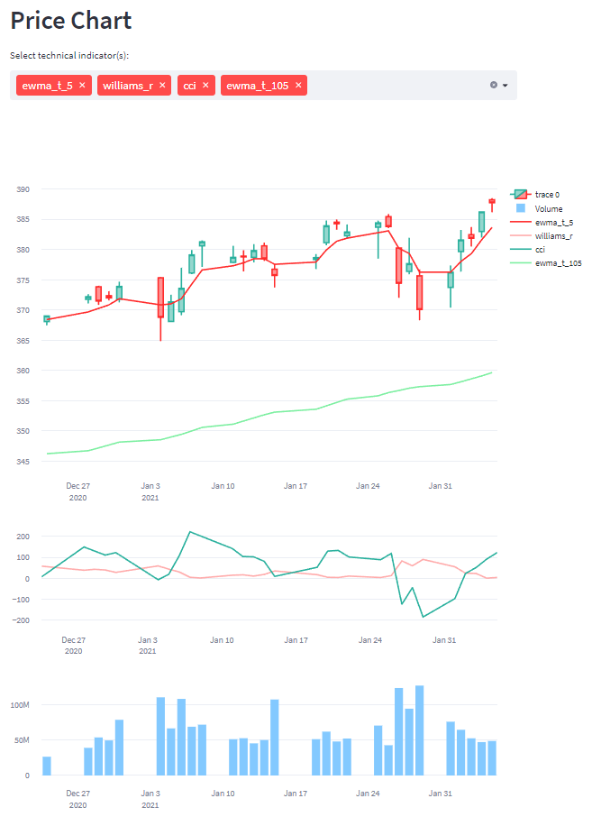

# Stock Trading Simulator (DEPRECATED due to server costs, this is only a personal project)

A stock trading simulator that allows you to train a ML model or write your own algo strategy to create signals to execute trades each day. 

### High level architecture:

## Features

### Daily data updates via Airflow

Data is automatically updated everyday to ensure the data is up to date via Airflow.

- load_stock_financial_data
    - call finnhub API to extract company financials data and store it into S3
- load_stock_price_data
    - call finnhub API to extract OHLCV data and store it into S3
- validate_and_write_to_staging
    - validate API output and create technical indicators as features and store it as a table into Redshift
- validate_and_write_to_prod
    - validate created features and write as an official, model ready table into Redshift

### Develop and revise your strategies in a controlled environment

Provides a safe environment to simulate trading as well as test strategies you've always wanted to try.

Use historical data + features to come up with optimal strategy (or train ML model)

Historical Data and Selected Technical Indicators:

### Run Automated Experimentation Process to Enhance Model Training

Run automated model experimentation processes which utilizes MLFlow and Hyperopt on an algo strategy or ML model. The process utilizes bayesian optimization to find optimal parameters for model training which leads to higher model performance.

Model Training Parameters:

MLFlow Experiments Table:

Model Diagnostics (Backtested returns):

### Get day by day performance to pinpoint errors for revisions in strategy

Predictions are marked green/red for correct/incorrect signals for each day to pinpoint errors for revisions in strategy:

|  Dashboard         |  Dashboard (Continued)         |
|:------------------------:|:------------------------:|
  |    |

### Instructions on how to create your own strategies

Under `app/model_definition`, create a file containing a class containing at least the `set_params()` and `predict()` methods:

- `set_params()`
    - Method to set hyperparameters for your strategy. This is typically called during the hyperparameter tuning step.
- `predict()`
    - Logic must output 1 or 0 representing buy/sell signals respectively

Next, under `app/main.py`, create the appropriate APIs that sends the model parameters to model experimentation

### Future Work

- Utilize API that feeds realtime data (potentially utilizing streaming service such as kafka)
- Improve frontend/User Experience
